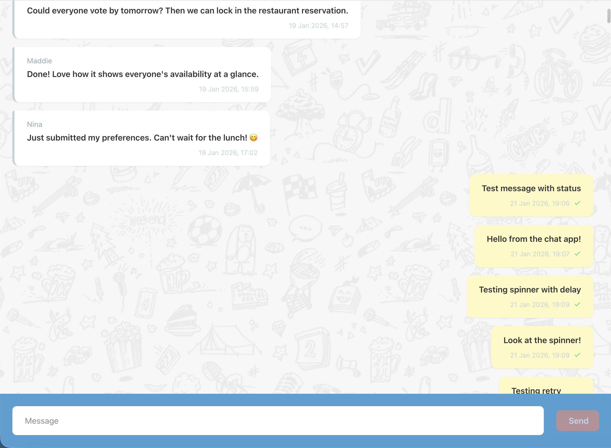
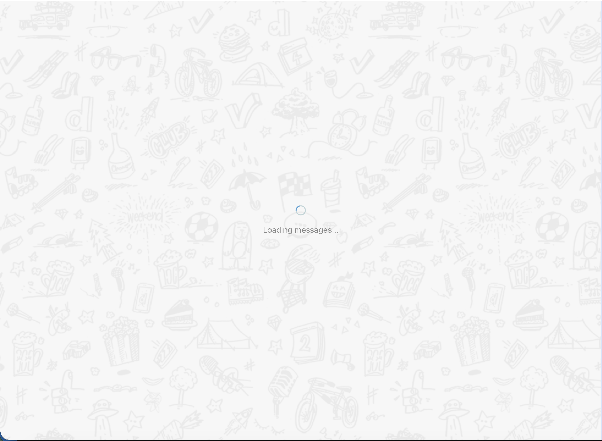
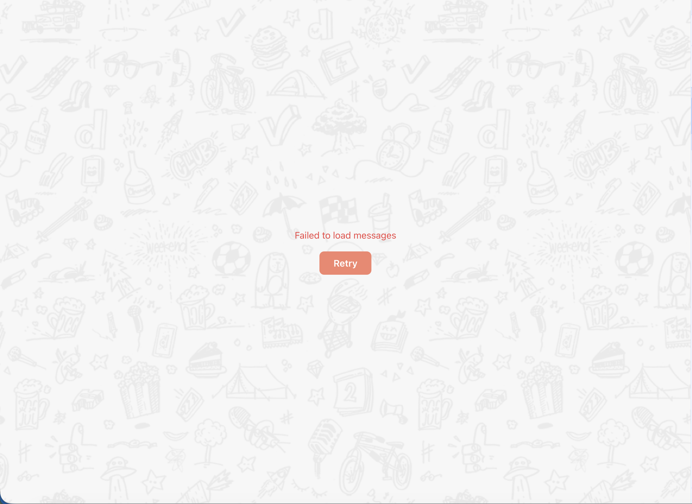
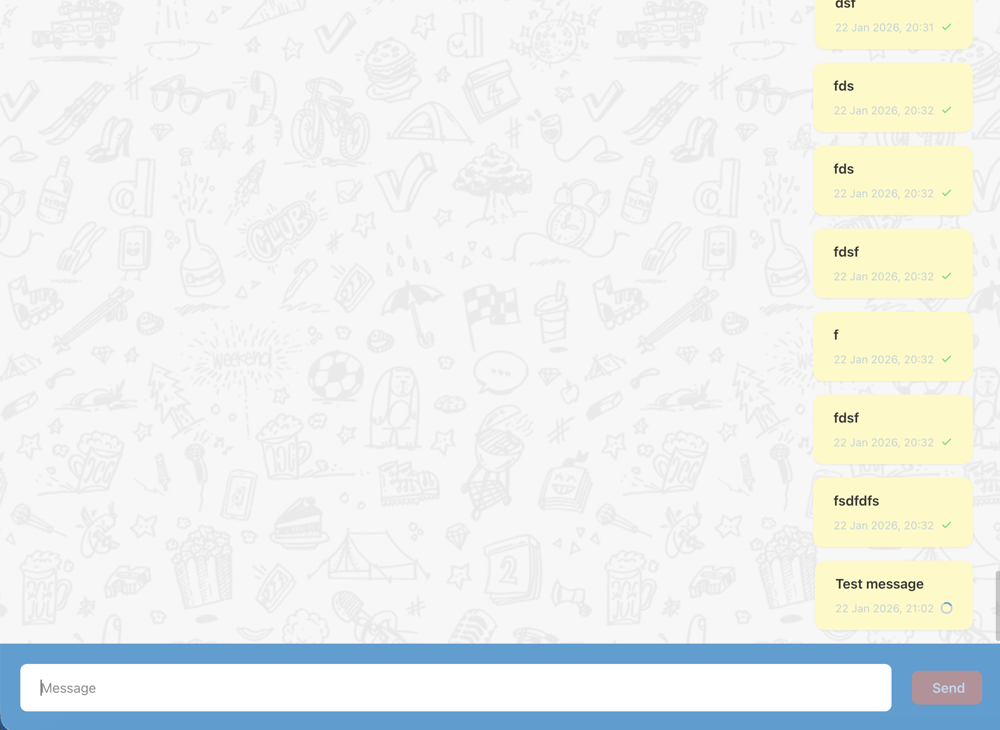
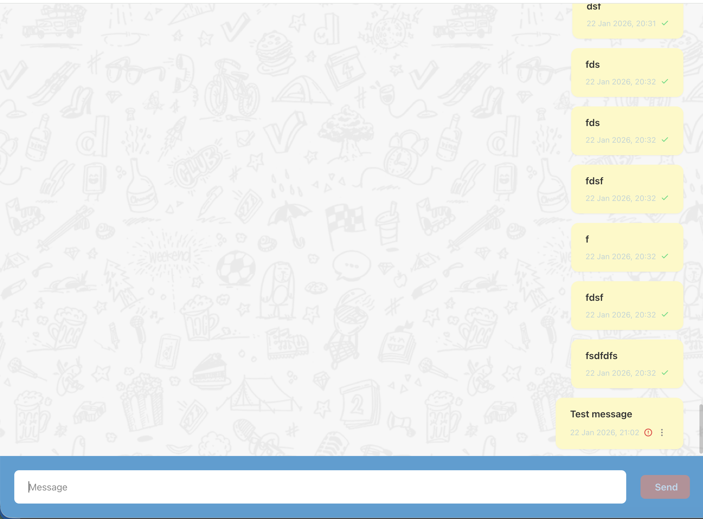
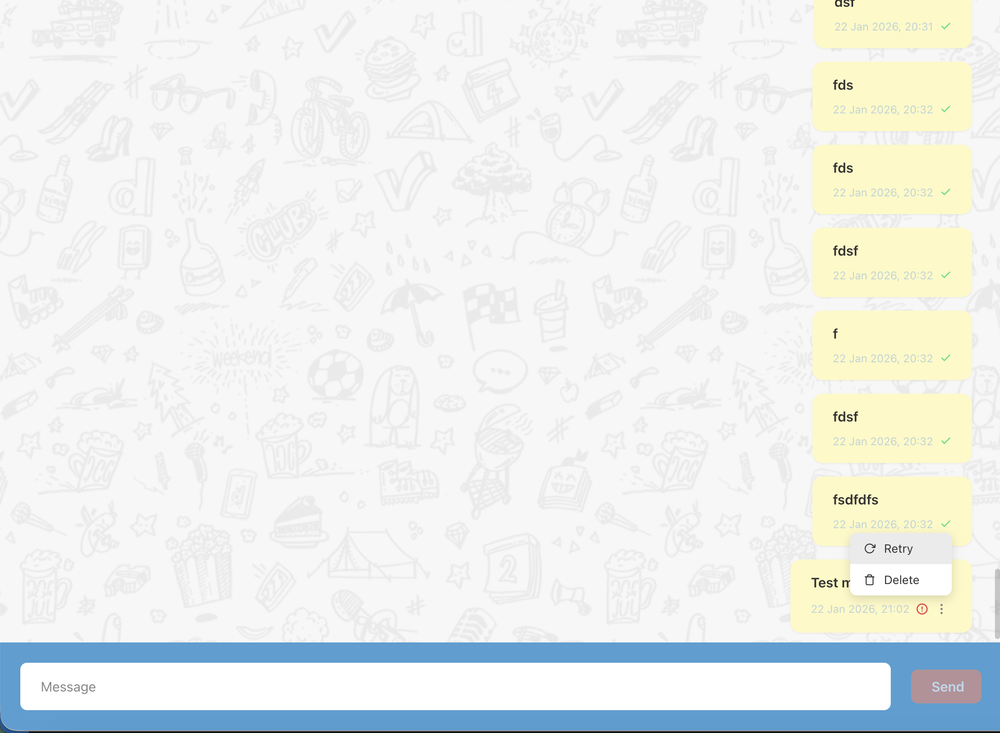

# Chat App

A real-time chat application built with React, TypeScript, and Vite.



## Prerequisites

Before running this project, make sure you have the following installed:

- **Node.js** v20 or higher - [Download](https://nodejs.org/)
- **npm** (comes with Node.js)
- **Docker** (for running the API) - [Download](https://www.docker.com/products/docker-desktop/)

## Backend API Setup

This application requires the [Doodle Frontend Challenge API](https://github.com/DoodleScheduling/frontend-challenge-chat-api) as its backend.

### Clone and run the API

```bash
# Clone the API repository
git clone https://github.com/DoodleScheduling/frontend-challenge-chat-api.git

# Navigate to the API directory
cd frontend-challenge-chat-api

# Start the API and MongoDB with Docker
docker compose up
```

The API will be available at `http://localhost:3000`. You can verify it's running by visiting:
- Health Check: http://localhost:3000/health
- Swagger Docs: http://localhost:3000/api/v1/docs

## Frontend Setup

### 1. Install dependencies

```bash
npm install
```

### 2. Run the development server

```bash
npm run dev
```

The app will be available at `http://localhost:5173`.

## Available Scripts

| Command | Description |
|---------|-------------|
| `npm run dev` | Start development server with hot reload |
| `npm run build` | Build for production |
| `npm run preview` | Preview production build |
| `npm run lint` | Run ESLint |

## Features

### Core Functionality
- **Real-time messaging** - Send and receive messages instantly
- **Infinite scroll** - Load older messages by scrolling up
- **Optimistic updates** - Messages appear immediately while being sent

### Message States
- **Sending** - Shows a loading spinner while the message is being sent
- **Sent** - Displays a checkmark icon when successfully delivered
- **Error** - Shows error icon with retry/delete options

### UI/UX
- **Virtualized list** - Efficient rendering of large message lists using `@tanstack/react-virtual`
- **Auto-scroll** - Automatically scrolls to newest messages
- **Loading states** - Visual feedback during initial load and pagination
- **Error handling** - Graceful error states with retry functionality
- **Responsive design** - Works on various screen sizes

### Accessibility
- **ARIA labels** - Screen reader support for messages, inputs, and buttons
- **Semantic HTML** - Proper use of `<article>`, `<time>`, `<main>`, and form elements
- **Live regions** - `aria-live="polite"` for dynamic message updates
- **Keyboard navigation** - Full keyboard support for all interactive elements

## Screenshots

### Initial Loading
Loading state when fetching messages for the first time.



### Loading Error
Error state when initial message fetch fails, with retry option.



### Loading Older Messages
Spinner shown when scrolling up to load older messages.


### Message Sending
Loading indicator while a message is being sent.



### Message Send Error
Error state for failed messages with action dropdown.



### Message Actions Dropdown
Retry or delete options for failed messages.



## Tech Stack

- **React 19** - UI library
- **TypeScript** - Type safety
- **Vite** - Build tool and dev server
- **TanStack Query** - Data fetching and caching
- **TanStack Virtual** - Virtualized list rendering
- **SASS Modules** - Scoped styling

## Project Structure

```
src/
├── api/              # API functions and keys
├── components/       # React components
│   ├── Button/
│   ├── Chat/
│   ├── Dropdown/
│   ├── Input/
│   ├── Message/
│   ├── MessageList/
│   └── Spinner/
├── config/           # App configuration
├── constants/        # Shared constants
├── hooks/            # Custom React hooks
├── icons/            # SVG icon components
├── types/            # TypeScript types
└── utils/            # Utility functions
```
